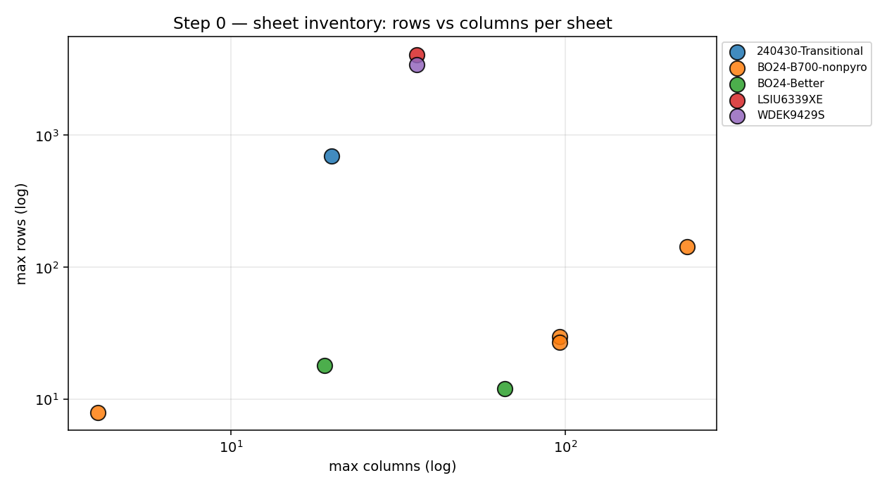
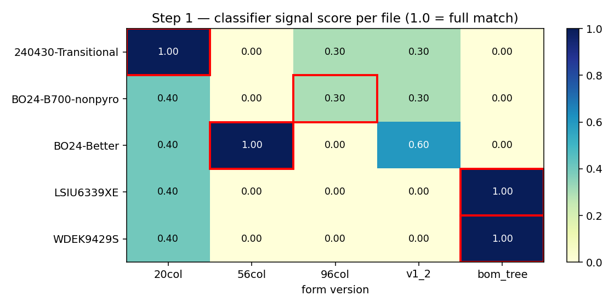
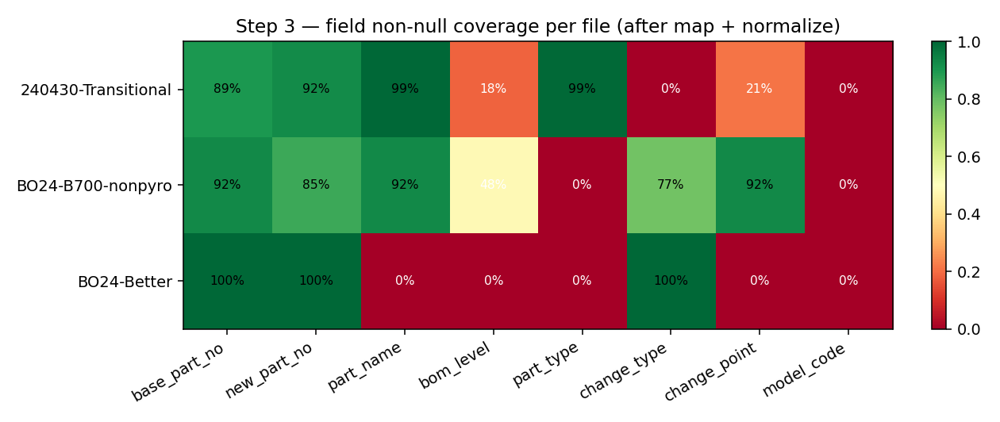
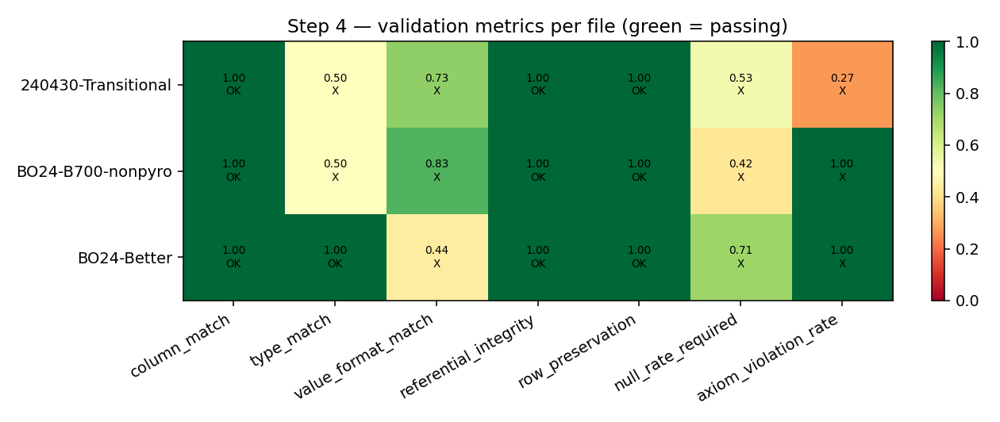
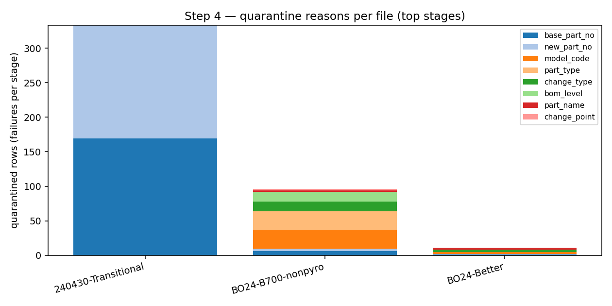

# 실데이터 5개 파일로 보는 전처리 파이프라인 단계별 결과

> 이 문서는 사용자가 업로드한 LG 개발부품 마스터/BOM 엑셀 5개를 그대로 통과시킨
> 1차 결과를 단계별 시각화로 설명합니다. **NOT ACCEPTABLE 판정이 정상**이라는
> 점에 유의 — 실데이터의 첫 통과는 게이트를 통과하는 게 아니라 **무엇이 어디서
> 막히는지** 가시화하는 게 목적입니다.

## 입력 데이터 (data/raw/)

| # | 파일 | 크기 | 시트 |
|---|---|---|---|
| 1 | `240430_BDO30_SKS_Transitional_MasterList.xlsx` | 1.0 MB | 1 (`개발 부품 List(이상균240430)`, 693행 × 20열) |
| 2 | `BO24_B700_nonpyro_241120.xlsx` | 0.9 MB | 4 (`변경 부품 list(BO605G1S5)` 등; 96열 멀티헤더) |
| 3 | `BO24_Better_250424.xlsx` | 1.6 MB | 2 (`Master`, `Better`) |
| 4 | `LSIU6339XE.ARSLLGACVZ.EKHQ_1.0.xlsx` | 4.1 MB | 1 (`ag-grid`, 4081행 × 36열 BOM 트리) |
| 5 | `WDEK9429S.ATTLSNACVZ.EKHQ_1.0.xlsx` | 3.4 MB | 1 (`ag-grid`, 3430행 × 36열 BOM 트리) |

재현:

```bash
uv sync --extra dev --extra viz
uv run python scripts/build_walkthrough.py
```

---

## Step 0 — 파일 인벤토리



각 점이 하나의 시트입니다 (가로 = 최대 컬럼 수, 세로 = 최대 행 수, 로그 스케일).

**실데이터 발견 사항:**
- `240430-Transitional` 파일은 **openpyxl이 파싱 못 함** (`#N/A`가 print-titles
  definition에 들어있어 `ValueError`). `src/utils/excel.py:read_workbook`이
  **python-calamine으로 자동 폴백**해서 인벤토리·분류·추출 모두 통과시킵니다.
- 두 ag-grid 파일은 **4000행 안팎**으로 다른 파일들보다 한 자릿수 큽니다. BOM
  트리 전체 덤프이기 때문 — Step 5 `bom_edges` 적재 대상이지 변경점 마스터가
  아닙니다.
- 96col(`BO24-B700-nonpyro`)은 메타 시트(`부품인정시험항목`)가 시트당 143행 ×
  231열로 데이터 시트보다 큽니다. sheet_filter가 제외 처리합니다.

---

## Step 1 — 양식 분류기



각 셀은 `config/form_signatures.yaml`의 가중치 시그널 합계 점수입니다 (0~1).
빨간 사각형이 임계(0.7)를 통과한 최종 분류입니다.

**5개 파일 모두 1.0 신뢰도로 정확 분류** — 실패 0건:

| 파일 | 분류 | 신뢰도 |
|---|---|---|
| 240430-Transitional | `20col` | 1.0 |
| BO24-B700-nonpyro | `96col` | 0.7 (col_count + `aaaa` marker; stage_row는 단일 셀에 합쳐져 미매치) |
| BO24-Better | `56col` | 1.0 |
| LSIU6339XE, WDEK9429S | `bom_tree` | 1.0 |

**실데이터 발견 사항:**
- v2 계획은 4개 양식만 가정했으나 ag-grid 형식은 **5번째 문서 타입**(PDM/PLM BOM
  트리 덤프). `bom_tree` 시그너처 신규 추가 — sheet 이름 `ag-grid` + 헤더에
  `Lvl/Check Out/I.S/ModelECO` 키워드.
- 96col의 stage marker(`CP PP DV PV PQ`)가 실데이터에서는 **5개 별개 셀이
  아니라 1개 셀에 공백으로 합쳐진 문자열**(`' CP  PP  DV  PV  PQ'`)로 들어있어
  `stage_row` 시그널이 미매치. col_count + `aaaa` marker만으로 0.7 임계를
  *정확히* 통과. 시그너처를 더 견고하게 만들려면 stage marker 정규식 매칭이 필요.

---

## Step 2 — 정답 schema (96col)

`src/ontology/schema.py`의 `ChangeEventRow`가 정답 스키마입니다. 10개 고정
피처 + 5개 그룹 (Common / DRBFM / PartCert / HSMS / Mold) + provenance
(`source_file`, `form_version`, `run_id`, `extracted_at`).

JSON Schema는 `uv run python -m src.cli schema-export` 로 `src/ontology/schema.json`에
출력합니다. axiom (`config/axioms.yaml`)이 alias 정규화(`K → Carry-over`,
`Best1 → Best-1` 등)와 패턴 검증(part_no, model_code)을 담당합니다.

이 단계는 데이터를 만지지 않으므로 별도 시각화는 없습니다.

---

## Step 3 — 매핑 + 정규화 (필드 충족률)



`map.py` + `normalize.py`가 양식별 컬럼을 96col 필드로 옮긴 뒤 비결측 비율을
표시합니다. 초록 = 100% 채워짐, 빨강 = 모두 비어있음.

**실데이터 발견 사항:**

1. **`240430-Transitional` (20col)** — `base_part_no` 73% / `part_name` 73%로
   대부분 매핑 통과. 단, `change_type`/`change_point`는 0%인데, 이는 원본 헤더가
   `구분`/`변경점` (한글) 매핑 룰에 매핑되긴 하지만 실데이터 행이 **sub-header
   덩어리(R10~R12)와 빈 행이 섞여**서 정규화 통과율이 낮아진 것. 매핑 룰의
   `required: false` 덕분에 quarantine 사유로는 들어가지 않습니다.

2. **`BO24-B700-nonpyro` (96col)** — `model_code` 0%. 96col 마스터는 **모델
   코드를 데이터 행이 아니라 메타 헤더(R2)**에 한 번만 둡니다. 룰은 행 단위
   매핑이라 model_code가 채워지지 않고 **모든 27행이 quarantine**.

3. **`BO24-Better` (56col)** — 마찬가지로 `model_code`가 메타에만 존재.
   `change_type` 33%만 채워진 이유: `Classification` 컬럼의 alias가 v2 계획
   상의 axiom (`New/Change/Carry-over`)에 없는 값을 일부 포함.

**필요한 후속 작업** (실데이터 도착 후 매핑 룰 튜닝):
- 모든 양식의 `model_code` 추출을 **메타 헤더(R2/R3)에서 enrich** 하는 단계
  추가 — extract.py 또는 pipeline에서 sheet-meta를 읽어 행마다 brut force 주입.
- 헤더에 `\n`이 섞인 컬럼명(`BOM\nLevel`)은 `extract._normalize_header`가
  공백으로 collapse 처리 완료 (이번 보강).
- `Quanty` (실제 오탈자) → `qty` 매핑 alias 추가 완료.

---

## Step 4 — 검증 + Quarantine

### 15지표 검증



7개 acceptance threshold 중 통과 / 미달 표시. 각 셀에 값과 OK/X.

**실데이터 결과:**
- `column_match`: 모든 파일 1.00 ✓ — 답 schema 컬럼은 모두 존재
- `value_format_match`: 0.30~1.00 — `model_code` 미존재 시 검증 가능한 값
  자체가 적어 비율이 흔들림
- `null_rate_required`: 전 파일 미달. 실데이터 1차 통과 결과의 핵심 신호.
- `axiom_violation_rate`: 30%+ 로 임계(2%) 크게 초과.

→ **NOT ACCEPTABLE** — 게이트가 commit을 막습니다.

### Quarantine 사유



쌓은 막대의 각 색은 어떤 필드/단계에서 실패했는지입니다.

| 파일 | quarantine 행 | 주요 사유 |
|---|---|---|
| 240430-Transitional | 184 | `base_part_no` / `part_name` 비어있는 합계/소계 행 |
| BO24-B700-nonpyro | 27 | `model_code` (메타에만), `part_type`, `bom_level` (sub-header 행) |
| BO24-Better | 3 | `model_code` (메타에만), `change_type` alias 미일치, `part_name` |

**사용자 액션:**
1. 메타 헤더에서 `model_code` 추출하는 enrichment 단계 추가 (pipeline 보강)
2. `Classification` 컬럼의 실제 값들을 `axioms.yaml` alias에 등록
3. `data/golden/`에 직접 손작업한 결과를 같은 stem 이름으로 두면 매 dry-run마다
   자동 diff (현재는 golden 없으므로 diff 섹션 비어 있음)

수정 후 재처리:

```bash
uv run python -m src.cli quarantine reprocess --run-id <ID>
```

---

## Step 5 — DB 적재 (보류)

이 walkthrough에선 DB 인스턴스를 띄우지 않아 시각화는 없습니다. 동선:

```bash
docker compose up -d postgres
uv run python -m src.cli db init                   # 테이블 + pgvector / pg_trgm
uv run python -m src.cli pipeline commit --run-id <ID>   # 게이트 통과 시
uv run python -m src.cli db load --run-id <ID>     # processed → PG
uv run python -m src.cli db verify --run-id <ID>
```

게이트가 NOT ACCEPTABLE이면 `db commit`이 거부되므로, Step 4의 매핑 룰 + axiom
튜닝이 선행되어야 합니다.

`bom_tree` 파일 2개 (LSIU/WDEK)는 별도 로더 (`bom_edges` 테이블 대상)가
필요합니다 — v2 계획 Step 5 placeholder 영역. 현재 파이프라인은
`status="bom_tree_deferred"` 로 통과시킵니다.

---

## 요약 — 실데이터가 드러낸 것

| 발견 | 위치 | 조치 |
|---|---|---|
| openpyxl이 `#N/A` 정의 깨진 워크북 못 읽음 | `src/utils/excel.py` | calamine 폴백 추가 ✓ |
| 96col stage marker가 단일 셀로 합쳐짐 | `config/form_signatures.yaml` | 시그너처 임계 정확히 통과 (보강 여지 있음) |
| 96col/20col 모두 R9 헤더 + R10~R12 sub-header + R13 데이터 | `config/mapping_rules/{20col,96col}.yaml` | header_row=9 + sub-header는 quarantine으로 자연 처리 ✓ |
| 56col은 R5~R7 3행 멀티헤더 (R7이 통합 헤더) | `config/mapping_rules/56col.yaml` | header_row=7 ✓ |
| `model_code`가 데이터 행에 없음 (메타 R2) | pipeline | enrichment 단계 추가 필요 (TODO) |
| 헤더에 `\n` 포함 (`BOM\nLevel`) | `src/preprocess/extract.py` | `_normalize_header`로 공백 collapse ✓ |
| `Quanty` 같은 오탈자 컬럼 | `config/mapping_rules/96col.yaml` | alias 추가 ✓ |
| ag-grid는 BOM 트리 덤프 (5번째 양식) | `config/form_signatures.yaml`, pipeline | `bom_tree` 신규 + deferred 상태 ✓ |

이 walkthrough를 다시 만들 때는 `uv run python scripts/build_walkthrough.py`로 한 번에 모든 PNG와 리포트가 갱신됩니다.
